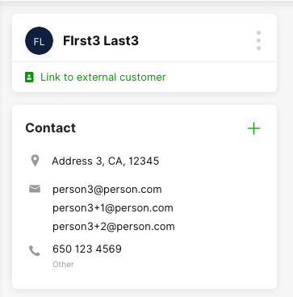
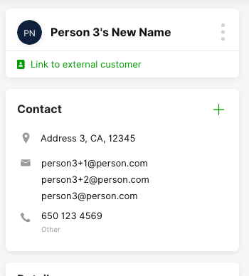
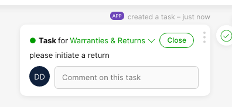

# Background

This repository contains code examples, written in node.js, depicting common use cases for how to utilize Gladly REST API.

This repository should be used as a tool for **learning** and not as production code!

# Setup

## Step 1: Generate Gladly API token

Please follow [these](https://developer.gladly.com/rest/#section/Getting-Started/Creating-API-Tokens) instructions to create an API token.

## Step 2: Setup .env file

Now, you can set up your environment variables. To do so, copy the `.env-sample` file found in the root folder of this repository into a new file called `.env` (also to be created at the root folder of this repository).

Set the following:
- `GLADLY_HOST`: Set this to your Gladly URL (e.g.: https://sandbox.gladly.qa), making sure to not have an ending `/` at the end and including the `https://` protocol at the beginning
- `GLADLY_USERNAME`: Your Gladly developer email address (e.g.: gladlyadmin@gladly.com)
- `GLADLY_API_TOKEN`: The API token that you generated in Step 1

Save the file

## Step 3: Install node modules

Make sure you are in the root directory of this repository on Terminal, then run this command:

`yarn install`

# Sample Scripts

## Create Customers

### What this script does

This script creates new customer profiles in Gladly utilizing a CSV file in `create-customers/sample-new-customers.csv`.

The script transforms each row in the CSV file to a customer profile object, then uses the [Gladly Create Customer API](https://developer.gladly.com/rest/#operation/createCustomer) to create the profile on Gladly.

When a profile is successfully created, the script will log the success using `console.log`

When a profile fails to be created, the script will log the error using `console.log`, along with the HTTP status code received.

The resultant profile looks something like this:



NOTE that the `customAttributes` may **not** display on your Gladly instance if you have not worked with a Gladly Support or Professional Services representative to configure them to display.

#### CSV to Gladly API data mapping logic

The script will loop through each row in the CSV file and import a customer profile using the following logic:
- `name`: this column is mapped to the Customer name on Gladly
- `address`: this column is mapped to the Customer address on Gladly
- `email:1`, `email:2`, `email:3`: these columns are added as email addresses to a single customer profile on Gladly. If the cell is blank, then the email will not be added to the profile. No email is imported as the `main` email. Note that emails are considered unique identifiers in Gladly, so if an email specified in one of these columns already exists in Gladly, the import for this row will fail.  
- `phone:1`, `phone:2`, `phone:3`: these columns are added as phone numbers to a single customer profile on Gladly. If the cell is blank, then the phone number will not be added to the profile. No phone number is currently set to the `main` phone number. Phone number is imported as type=OTHER (not MOBILE, which is considered a unique identifier in Gladly)

In addition, the script will auto-create an identifier for the customer profile using the [slugid](https://www.npmjs.com/package/slugid) node.js library.

A sample payload can be found below:
```
{"id":"XRJvp8lSS5aD2RucjY5zkw","name":"First1 Last1","address":"Address 1, CA, 12345","emails":[{"original":"person1@person.com"}],"phones":[{"original":"650 123 4567"},{"original":"650 123 4571"}],"customAttributes":{"attr1":"hello","attr3":"world"}}
```

### How to use script

Make sure you are in the root directory of this repository on Terminal, then run this command:

`node create-customers`

### Sample console logs from script

```
SUCCESS - ROW 0: Created customer with ID XRJvp8lSS5aD2RucjY5zkw and payload {"id":"XRJvp8lSS5aD2RucjY5zkw","name":"First1 Last1","address":"Address 1, CA, 12345","emails":[{"original":"person1@person.com"}],"phones":[{"original":"650 123 4567"},{"original":"650 123 4571"}],"customAttributes":{"attr1":"hello","attr3":"world"}}
SUCCESS - ROW 3: Created customer with ID Wr3Cr5hGS9ucpnWnO_Uhxg and payload {"id":"Wr3Cr5hGS9ucpnWnO_Uhxg","name":"First4 Last4","address":"Address 4, CA, 12345","emails":[{"original":"person4@person.com"}],"phones":[{"original":"650 123 4570"}],"customAttributes":{"attr2":"world"}}
SUCCESS - ROW 1: Created customer with ID OPy0kbYIQp-mr3IcdQRWqw and payload {"id":"OPy0kbYIQp-mr3IcdQRWqw","name":"First2 Last2","address":"Address 2, CA, 12345","emails":[{"original":"person2@person.com"}],"phones":[{"original":"650 123 4568"}],"customAttributes":{"attr2":"world"}}
SUCCESS - ROW 2: Created customer with ID fWF-Q4lwTVepss3W2P2Cfw and payload {"id":"fWF-Q4lwTVepss3W2P2Cfw","name":"FIrst3 Last3","address":"Address 3, CA, 12345","emails":[{"original":"person3@person.com"},{"original":"person3+1@person.com"},{"original":"person3+2@person.com"}],"phones":[{"original":"650 123 4569"}],"customAttributes":{"attr3":"hi"}}
```

## Update Customers

We recommend utilizing this script after running the `create-customers` script.

### What this script does

This script updates customer profiles in Gladly utilizing a CSV file in `update-customers/sample-update-customers.csv`.

The script searches for the customer profile in Gladly using the `email` column and the [Gladly Find Customer API](https://developer.gladly.com/rest/#operation/findCustomers). Note that email is considered a unique identifier in Gladly, so if a matching profile is found, there will only be one potential result returned.

If a match is found, the script will then set the returned object's `name` value to the `name` in the CSV file and call the [Gladly Update Customer API](https://developer.gladly.com/rest/#operation/updateCustomer) to update the profile in Gladly.

When a profile is successfully updated, the script will log the success using `console.log`

When a profile fails to be update, the script will log the error using `console.log`, along with the HTTP status code received.

The resultant profile looks something like this:



### How to use script

Make sure you are in the root directory of this repository on Terminal, then run this command:

`node update-customers`

### Sample console logs from script

```
SUCCESS - ROW 2: Found a match for customer with email person3@person.com. Attempting to update profile
SUCCESS - ROW 1: Found a match for customer with email person2@person.com. Attempting to update profile
SUCCESS - ROW 0: Found a match for customer with email person1@person.com. Attempting to update profile
SUCCESS - ROW 3: Found a match for customer with email person4@person.com. Attempting to update profile
SUCCESS - ROW 1: Updated customer profile with payload {"address":"Address 2, CA, 12345","customAttributes":{"attr2":"world"},"emails":[{"normalized":"person2@person.com","original":"person2@person.com"}],"name":"Person 2's New Name","phones":[{"normalized":"+16501234568","original":"650 123 4568","regionCode":"US","type":""}],"id":"OPy0kbYIQp-mr3IcdQRWqw","createdAt":"2021-09-28T21:10:10.373Z"}
SUCCESS - ROW 2: Updated customer profile with payload {"address":"Address 3, CA, 12345","customAttributes":{"attr3":"hi"},"emails":[{"normalized":"person3@person.com","original":"person3@person.com"},{"normalized":"person3+1@person.com","original":"person3+1@person.com"},{"normalized":"person3+2@person.com","original":"person3+2@person.com"}],"name":"Person 3's New Name","phones":[{"normalized":"+16501234569","original":"650 123 4569","regionCode":"US","type":""}],"id":"fWF-Q4lwTVepss3W2P2Cfw","createdAt":"2021-09-28T21:10:10.378Z"}
SUCCESS - ROW 3: Updated customer profile with payload {"address":"Address 4, CA, 12345","customAttributes":{"attr2":"world"},"emails":[{"normalized":"person4@person.com","original":"person4@person.com"}],"name":"Person 4's New Name","phones":[{"normalized":"+16501234570","original":"650 123 4570","regionCode":"US","type":""}],"id":"Wr3Cr5hGS9ucpnWnO_Uhxg","createdAt":"2021-09-28T21:10:10.370Z"}
SUCCESS - ROW 0: Updated customer profile with payload {"address":"Address 1, CA, 12345","customAttributes":{"attr1":"hello","attr3":"world"},"emails":[{"normalized":"person1@person.com","original":"person1@person.com"}],"name":"Person 1's New Name","phones":[{"normalized":"+16501234567","original":"650 123 4567","regionCode":"US","type":""},{"normalized":"+16501234571","original":"650 123 4571","regionCode":"US","type":""}],"id":"XRJvp8lSS5aD2RucjY5zkw","createdAt":"2021-09-28T21:10:10.262Z"}
```


## Create Tasks

We recommend utilizing this script after running the `create-customers` script.

### What this script does

This script creates tasks in Gladly utilizing a CSV file in `create-tasks/sample-new-tasks.csv`.

The script accomplishes this by doing the following:
- Lists all inboxes and agents using the [Gladly list inboxes API](https://developer.gladly.com/rest/#operation/getInboxes) and the [Gladly list agents API](https://developer.gladly.com/rest/#operation/getAgents)
- For each row in the CSV file, map the `inboxName` column to the appropriate Gladly inbox ID, and the `agentEmail` column to the appropriate Gladly agent ID (if this column is specified). An error is throw for this row if `inboxName` is not supplied / does not match an inbox name in Gladly, or if `agentEmail` is supplied, but does not match an agent email address in Gladly.
- Call the [Gladly create task API](https://developer.gladly.com/rest/#operation/createTaskAndCustomer) to create a new task with the due date set to the `dueAt` column, the task body set to the `task` column and the `customer.emailAddress` field set to the `email` column in the CSV

A sample task POST body can be found below:
```
{"id":"G2tzvtq1TPWcxqlf1h2vng","assignee":{"inboxId":"0tvvSDnvQVGchp-GaxCeGQ","agentId":null},"body":"please initiate a return","dueAt":"2024-09-28T00:00:00.000Z","customer":{"emailAddress":"person2@person.com"}}
```

When a task is successfully created, the script will log the success using `console.log`

When a task fails to be created, the script will log the error using `console.log`, along with the HTTP status code received.

The resultant task looks something like this:



### How to use script

Make sure you are in the root directory of this repository on Terminal, then run this command:

`node create-tasks`

### Sample console logs from script

```
ERROR - ROW 2: Inbox witih name  was specified in CSV file but could not be found in Gladly
ERROR - ROW 3: Inbox witih name  was specified in CSV file but could not be found in Gladly
ERROR - ROW 4: Inbox witih name inbox name was specified in CSV file but could not be found in Gladly


Starting API calls


SUCCESS - ROW 1: Created task with ID G2tzvtq1TPWcxqlf1h2vng and payload {"id":"G2tzvtq1TPWcxqlf1h2vng","assignee":{"inboxId":"0tvvSDnvQVGchp-GaxCeGQ","agentId":null},"body":"please initiate a return","dueAt":"2024-09-28T00:00:00.000Z","customer":{"emailAddress":"person2@person.com"}}
SUCCESS - ROW 0: Created task with ID ade2kDvwRnaA7ewXYtMyag and payload {"id":"ade2kDvwRnaA7ewXYtMyag","assignee":{"inboxId":"0tvvSDnvQVGchp-GaxCeGQ","agentId":"XeEJwrnuTfabHMK5ZW1fGg"},"body":"please create a return label","dueAt":"2023-09-28T00:00:00.000Z","customer":{"emailAddress":"person1@person.com"}}


Finished processing file
```

## Get Data Export

### What this script does

This script calls the [Gladly List Jobs API](https://developer.gladly.com/rest/#operation/findJobs), and then retrieves the job ID with the latest updatedAt date.

This script will then call the [Gladly Get File API](https://developer.gladly.com/rest/#operation/getFile) to download the associated job's `conversation_items.jsonl` file into a local file stored on `/tmp/conversation_items.jsonl`.

Upon download, the script will then go through each line in the `/tmp/conversation_items.jsonl` file and output a log.

### How to use script

Make sure you are in the root directory of this repository on Terminal, then run this command:

`node get-data-export`

### Sample console logs from script
```
Got line from conversation_items.jsonl file: {"id":"9Xk3zKeuQMyQi2qjmDErDw","conversationId":"mTs0fj5qSo63Sg4RRuulPQ","content":{"content":"54321","messageType":"TEXT","sessionId":"5zjcbHOARMOmg8t11esqpA","type":"CHAT_MESSAGE"},"customerId":"594wMEbZSx-RmYSkUMeCPw","initiator":{"type":"CUSTOMER","id":"594wMEbZSx-RmYSkUMeCPw"},"timestamp":"2021-09-27T21:12:34.635Z"}
Got line from conversation_items.jsonl file: {"id":"UbUhScmvQCWR3qJgKr5fjg","conversationId":"mTs0fj5qSo63Sg4RRuulPQ","content":{"content":"First reply - clears SLA","messageType":"TEXT","sessionId":"5zjcbHOARMOmg8t11esqpA","type":"CHAT_MESSAGE"},"customerId":"594wMEbZSx-RmYSkUMeCPw","initiator":{"type":"AGENT","id":"XeEJwrnuTfabHMK5ZW1fGg"},"timestamp":"2021-09-27T21:12:50.277Z"}
Got line from conversation_items.jsonl file: {"id":"2DR0XwcbSVeo21lwx57D4g","conversationId":"mTs0fj5qSo63Sg4RRuulPQ","content":{"content":"2nd customer reply","messageType":"TEXT","sessionId":"5zjcbHOARMOmg8t11esqpA","type":"CHAT_MESSAGE"},"customerId":"594wMEbZSx-RmYSkUMeCPw","initiator":{"type":"CUSTOMER","id":"594wMEbZSx-RmYSkUMeCPw"},"timestamp":"2021-09-27T21:13:21.598Z"}
Got line from conversation_items.jsonl file: {"id":"xK9cnHU1QMWF95HKNdKNTg","conversationId":"UCeDRWE1Ro6vMYZ_MqPHsA","content":{"content":"Testing","messageType":"TEXT","sessionId":"4Ggwv__JSQGkvFxaQnzF_A","type":"CHAT_MESSAGE"},"customerId":"rvk8ApFfSL2iczWlNaISNQ","initiator":{"type":"CUSTOMER","id":"rvk8ApFfSL2iczWlNaISNQ"},"timestamp":"2021-09-27T21:15:57.618Z"}
```

## Get Reports

### What this script does

This script calls the [Gladly Work Sessions API](https://developer.gladly.com/rest/#tag/Reports/paths/~1api~1v1~1reports~1work-session-events/post) and logs the sum of the `work_session_handle_time` detected in that file.

This script then calls the [Gladly Generate Report API](https://developer.gladly.com/rest/#tag/Reports/paths/~1api~1v1~1reports/post) to retrieve the `ContactExportReport` ([documentation here](https://help.gladly.com/docs/contact-export?highlight=contact%20export)) and outputs the number of EMAIL contacts created on 09/28/21 Pacific Time.

Afterwards, the script calls the [Gladly Generate Report API](https://developer.gladly.com/rest/#tag/Reports/paths/~1api~1v1~1reports/post) to retrieve the `AgentTimestampsReport` ([documentation here](https://help.gladly.com/docs/agent-timestamps)) and outputs the number of `AGENT_STATUS/LOGGED_IN` events that occurred on 09/28/21 Pacific Time.

Note that the script calls reporting APIs 1 by 1, which helps keep us under the specific reporting API organization rate limit.

### How to use script

Make sure you are in the root directory of this repository on Terminal, then run this command:

`node get-reports`

### Sample console logs from script

```
Detected 35.529 of work session handle time for contacts ended between 2021-09-28T00:00-07:00 and 2021-09-29T00:00-07:00. Used payload {"startAtTime":"2021-09-28T00:00-07:00","endAtTime":"2021-09-29T00:00-07:00"}
Detected 0 EMAIL contact(s) created on 09/28/21 America/Los_Angeles timezone. Used payload {"metricSet":"ContactExportReport","timezone":"America/Los_Angeles","startAt":"2021-09-28","endAt":"2021-09-28"}
Detected 1 agent logged in event(s) on 09/28/21 America/Los_Angeles timezone. Used payload {"metricSet":"AgentTimestampsReport","timezone":"America/Los_Angeles","startAt":"2021-09-28","endAt":"2021-09-28","filters":{}}
```

## Close Conversations

### What this script does

This script adds a topic to conversations in Gladly, and then closes them utilizing a CSV file in `close-conversations/sample-close-conversations.csv`.

The script accomplishes this by doing the following:
- Retrieves the conversation from Gladly using the [Get Conversation API](https://developer.gladly.com/rest/#operation/getConversation)
- Adds a topic to the conversation, as defined in the CSV file, using the [Add Topic API](https://developer.gladly.com/rest/#operation/addTopicToConversation)
- Closes the conversation, assigning it to the conversationId and agentId values the conversation is currently assigned to using the [Update Conversation API](https://developer.gladly.com/rest/#operation/patchConversation). If Agent is deactivated (meaning that they cannot be found via the [LIST Agents](https://developer.gladly.com/rest/#operation/getAgents) API call anymore), the conversation will be assigned to the inbox and Agent will be unassigned.

### How to use script

First, open up `close-conversations/sample-close-conversations.csv` and populate it with conversation + topic ID values from your very own Gladly instance.

Save your edits to this file.

Make sure you are in the root directory of this repository on Terminal, then run this command:

`node close-conversations`

### Sample console logs from script

```
Starting API calls


SUCCESS - ROW 0: Closed conversation ID pzQgtVEsSsWho4qm1086WA


Finished processing file
```

## Events WFM

### What this script does

This script uses the Events API to calculate Voice availability time, agent-initiated hold time and number of outbound phone calls on an agent-by-agent basis within 30 minute intervals. The script does this by calling the [Events API](https://developer.gladly.com/rest/#tag/Events/paths/~1api~1v1~1events/get) and retrieving events for `CONTACT` and `AGENT_AVAILABILITY`.

The script will output the duration of time (in minutes) that an Agent spent on hold & available for voice + the number of outbound phone calls an agent placed, sorted into 30 minute buckets.

### How to use script

Make sure you are in the root directory of this repository on Terminal, then run this command:

`node events-wfm`

### Sample console logs from script

```
Voice: Hold Time
[
  {
    'Agent ID': 'agent---',
    'Interval Start At': '2021-11-09 05:00',
    Timezone: 'America/Los_Angeles',
    'Interval Duration (minute)': 30,
    'Agent Initiated Hold Time (minutes)': 6.033333333333333
  },
  {
    'Agent ID': 'agent2---',
    'Interval Start At': '2021-11-09 05:00',
    Timezone: 'America/Los_Angeles',
    'Interval Duration (minute)': 30,
    'Agent Initiated Hold Time (minutes)': 4.566666666666666
  }
]

Voice: Hold Time
[
  {
    'Agent ID': 'agent---',
    'Interval Start At': '2021-11-09 05:00',
    Timezone: 'America/Los_Angeles',
    'Interval Duration (minute)': 30,
    'Agent Initiated Hold Time (minutes)': 6.033333333333333
  },
  {
    'Agent ID': 'agent2---',
    'Interval Start At': '2021-11-09 05:00',
    Timezone: 'America/Los_Angeles',
    'Interval Duration (minute)': 30,
    'Agent Initiated Hold Time (minutes)': 4.566666666666666
  },
  {
    'Agent ID': 'agent3---',
    'Interval Start At': '2021-11-09 05:00',
    Timezone: 'America/Los_Angeles',
    'Interval Duration (minute)': 30,
    'Agent Initiated Hold Time (minutes)': 1.2999999999999998
  }
]

PHONE_CALL: Outbound Created
[
  {
    'Agent ID': 'agent---',
    'Interval Start At': '2021-11-09 06:00',
    Timezone: 'America/Los_Angeles',
    'Interval Duration (minute)': 30,
    'Contacts Created': 2,
    Channel: 'PHONE_CALL'
  },
  {
    'Agent ID': 'agent2---',
    'Interval Start At': '2021-11-09 06:00',
    Timezone: 'America/Los_Angeles',
    'Interval Duration (minute)': 30,
    'Contacts Created': 1,
    Channel: 'PHONE_CALL'
  }
]
```
